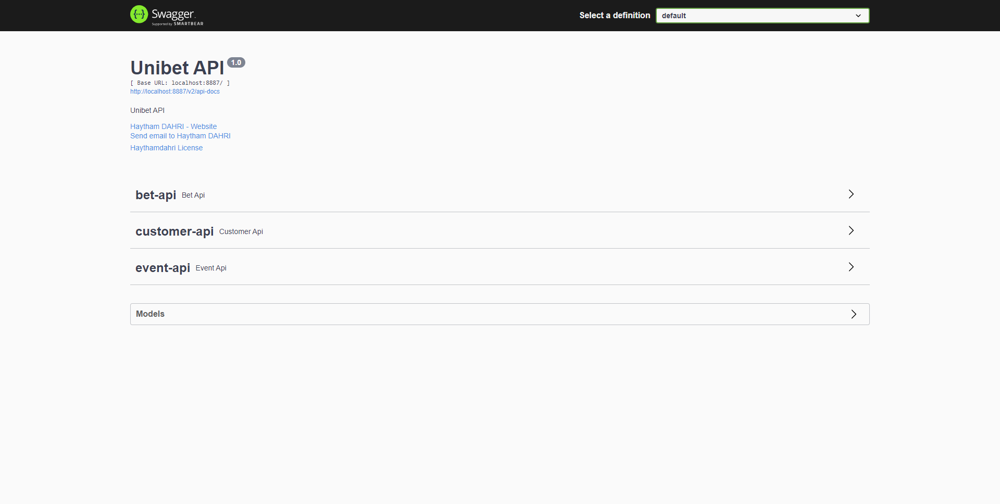

# Unibet API
API serves users to enter into bets

### Technical choices:
1. Spring Boot for Web API endpoints exposition and database interaction
2. H2 Database to store business model data
3. Map struct to map Business Object (BO - Entities) into Data transfer Objects (DTO), this step aims to hide unecessary data from the client
4. Swagger documentation to extract endpoints contracts, inputs and outputs
5. Apache commons libraries to manipulate lists and dates

### How to start
1. Download necessary libraries put in `pom.xml` file
2. Start the application via: `mvn spring-boot:run`
3. Check swagger documentation for API usage: http://localhost:8887/swagger-ui/#/
   
### How to use
Import [Postman Collection](Unibet.postman_collection.json) and play the game

### Remaining work
This project requires Unit and integration tests in order to prevent any regression for future versions